# Hi, I'm David 👋

<picture>
  <source media="(prefers-color-scheme: dark)" srcset="./dark.svg">
  <source media="(prefers-color-scheme: light)" srcset="./light.svg">
  
</picture>

  <b>Computer Science Student · Software Engineering · AI & Automation</b>

  🤖 AI / LLMs &nbsp;·&nbsp; 📱 Android &nbsp;·&nbsp; 🐍 Python &nbsp;·&nbsp; ☕ Kotlin / Java &nbsp;·&nbsp; ⚙️ Automation

I'm a Computer Science student and software engineering enthusiast who enjoys turning ideas into practical digital products.

I focus on building things that combine **software, AI, automation, mobile technology, and clean UI/UX**.

---

## What I Build

- 🧠 **AI-powered applications and assistants**
- 📱 **Android and mobile applications**
- ⚙️ **Automation tools and API integrations**
- 🎨 **Modern UI/UX experiences**
- 🛠️ **Developer tools and experiments**
- 📦 **Practical software projects**

---

## Featured Projects

### 📱 DarkRoot App Store
A curated Android application platform focused on discovering and distributing useful applications.

**Focus:** Android · Apps · Mobile  
[View Project](https://github.com/darkroot-pub/DarkRoot_App_Store)

### 🤖 DarkRoot AI
An AI-powered platform exploring intelligent assistants, APIs, automation, and AI experiences.

**Focus:** AI · LLMs · APIs  
[Live Demo](https://darkroot-ai.netlify.app/)

### 🌐 Personal Portfolio
My personal portfolio showcasing projects, experiments, skills, and my development journey.

**Focus:** Portfolio · UI/UX · Web  
[Visit Portfolio](https://about-david.vercel.app/)

---

## Tech Stack

**Languages**  
`Python` · `Kotlin` · `Java` · `C` · `HTML` · `MySQL`

**Development**  
`Android Studio` · `Git` · `GitHub` · `Firebase` · `Figma` · `Linux`

**Areas of Interest**  
AI & LLMs · Android · Automation · API Integration · UI/UX · Software Engineering · Developer Tools · Cybersecurity

---

## Currently Exploring

| Area       | Current Focus                              |
|------------|--------------------------------------------|
| AI         | LLM applications & intelligent assistants  |
| Android    | Modern mobile application development      |
| Backend    | APIs, integrations & automation            |
| UI/UX      | Clean, responsive & modern interfaces      |
| Security   | Ethical hacking & cybersecurity fundamentals |

---

## Development Philosophy

> Learn → Build → Test → Improve → Repeat

Curiosity creates the idea.  
Code turns the idea into reality.  
Iteration makes the result better.

---

## Connect

[Portfolio](https://about-david.vercel.app/) · [GitHub](https://github.com/darkroot-pub) · [Email](mailto:davidstha900@gmail.com)

  <i>Let's build something useful.</i>

